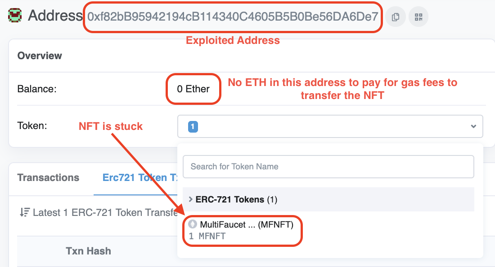

## Rescuing An NFT Using Flashbots

### Problem: 

Imagine a developer accidently uploads his Ethereum private key to a public Github repo. It's only a matter of minutes before a bot will sweep the entire balance of this developer's ETH. Suppose the developer also had an NFT associated with this exposed wallet. In this case, it's highly unlikely the bot will detect NFT so this gives the developer some time to think about how to rescue his NFT. 

Here's the key problem - in order to transfer the NFT to a new safe address there needs to be ETH in the exploited address to pay for the gas fees of the NFT transfer. However, the moment any any ETH is sent to this exploited address, bots will detect the incomng funds and immediately withdraw funds. This could leave the NFT stuck in the exploited address as the developer is not able to fund this address with enough ETH to pay for the gas transaction costs. Even if he was able to succesfully fund the exploited address, when the developer tries to transfer the NFT to a new address, there's a risk this activity may alert bots and cause them to front-run the transaction leading them to steal the NFT. 

### Solution: 

Rather than sending the transaction through the public mempool, a user could use Flashbots and group multiple transactions into the same bundle provided they are atomic. In this case, the developer could create a sponsor transaction where he can make a transaction from account X but pay for this transaction's gas fees from account Y. Below is a diagram showcasing the steps associated with this process:


- Transaction 1: The sponsor address will transfer a small portion of ETH to the exploited address to pay for the gas fees to transfer the NFT to a safe address
- Transaction 2: Transfer the NFT from the exploited address to the safe address

## Walkthrough: 

1. The NFT in this example is trapped in the exploited address. Currently there’s no ETH in the exploited address and if anyone were to send ETH to this address it would immediately be swept up by sniper bots.  



2. At the same time the user has a sponsor address which will be used to pay for the transaction gas fees to rescue the NFT and move it to the sponsor’s address. 


3. The user will have to compile these two transactions into a calling the `signedTxBundle` RPC endpoint will be sent to the Flashbots relayer. Note: given all of this is done at once (ie: atomically) there’s no feasible way for a sniper to front-run and beat us to this transaction. From here the Flashbots relayer will directly connect the user’s transaction to miners. If miners choose to include this bundle into the block then the developer has successfully rescued his NFT. In the case the miner doesn’t include this transaction in the current block, nobody will know about this transaction given it did not touch the public mempool. When this happens the developer would have to re-submit their transaction until the miner finally includes it in the block (ie: the developer could increase the gas fee to incentivize the miner to include it in the block faster).  

```javascript
// sign the transactions into a single flashbots bundle
const signedTxBundle = await flashbotProvider.signBundle([
    {   
        // the sponsor will be sending ETH to the exploited address in tx1
        signer: sponsor,
        transaction: tx1
    },
    {
        // the exploited address will send the NFT to the sponsor address in tx2
        signer: exploited,
        transaction: tx2
    }
]);
```

4. Using the [`sponsorTx.js`](https://github.com/schepal/flashbots_playground/blob/main/nft-sponosored-tx/src/sponsorTx.js) script we were able to successfully transfer the NFT from the exploited address. Notice how the sponsor address now has the NFT which is previously stuck in the exploited address. At the same time notice how the exploited address no longer has the NFT in its balance. There is some ETH remaining from the sponsor paying it (note: this can be improved by more accurately estimating gas - in this case it was just as an example). This remaining ETH would be sniped away immediately once it hits the address.  


<br/>


### Goerli Addresses Used In This Analysis:
- Exploited Address: [`0x39405b216a9a4a1a1e3439cb311543b09c7f3e50`](https://goerli.etherscan.io/address/0x39405b216a9a4a1a1e3439cb311543b09c7f3e50)
- Sponsor Address: [`0xf82bB95942194cB114340C4605B5B0Be56DA6De7`](https://goerli.etherscan.io/address/0xf82bB95942194cB114340C4605B5B0Be56DA6De7)
- Deployed NFT Address (thanks to Paradigm's awesome [faucet](https://faucet.paradigm.xyz/)): [`0xf5de760f2e916647fd766b4ad9e85ff943ce3a2b`](https://goerli.etherscan.io/address/0xf5de760f2e916647fd766b4ad9e85ff943ce3a2b)


